## Goal

- 3D Visualization of large-scale GIS^[Geographic information system] dataset
  - 1670 $km^2$ and more
- Example of dataset: [swissBUILDINGS3D 3.0 Beta
](https://map.geo.admin.ch/#/map?lang=fr&sr=3857&camera=6.139928,46.175321,441.8,-2,5,&3d&topic=ech&layers=ch.swisstopo.swissimage-product@year=current&bgLayer=ch.swisstopo.pixelkarte-farbe&catalogNodes=ech,532)

# Introduction

## Quiz

Which one is real ?

::: {layout-ncol="2"}

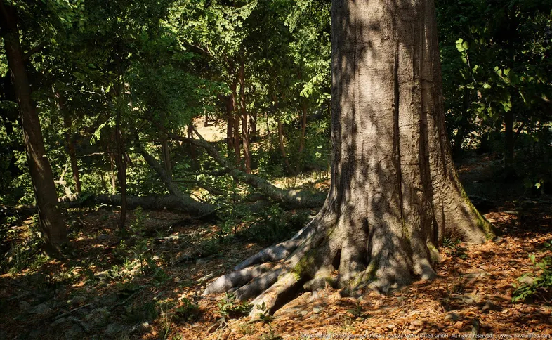

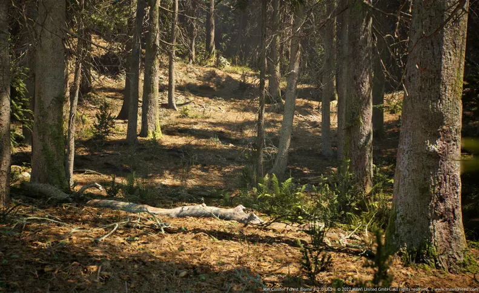

:::

## Motivations {background-video="./img/video.mp4"}

- Improvements in computational performance since the 1970s
- Game engines essort
  - Ray tracing
  - Nanite
  - Lumen

**$\Longrightarrow$ Massive open word creation !**

## Used hardware {.r-fit-text}

| Computer / Parameters | PC1                 | PC2                 |
|-----------------------|--------------------------------|----------------------------------|
| **CPU**               | AMD Ryzen 9 7950X3D            | Intel Core i9-10940X             |
| **GPU**               | NVIDIA GeForce RTX 4090        | NVIDIA GeForce RTX 3070          |
| **RAM**               | 64 GB DDR5 6600 MHz CL32       | 64 GB DDR4 3200 MHz CL22         |

## Unreal Engine

1. Practical: used for Vltava project

2. Technical: Suitable for real-time rendering of a vast open world with high visual graphics quality 

3. Moral: Unity prioritizes monetization

## Other softwares

- GIS softwares (from [ESRI](https://www.esri.com))
  - [ArcGIS Pro](https://www.esri.com/en-us/arcgis/products/arcgis-pro/overview)
  - [CityEngine](https://www.esri.com/en-us/arcgis/products/arcgis-cityengine/overview)
- [GIMP](https://www.gimp.org/)

## Data source

::: {layout-ncol="2"}
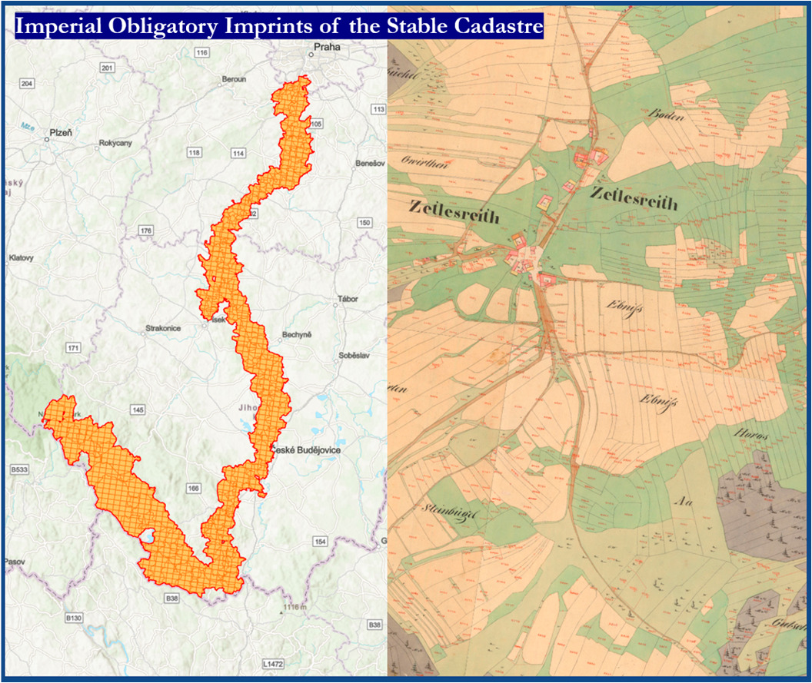

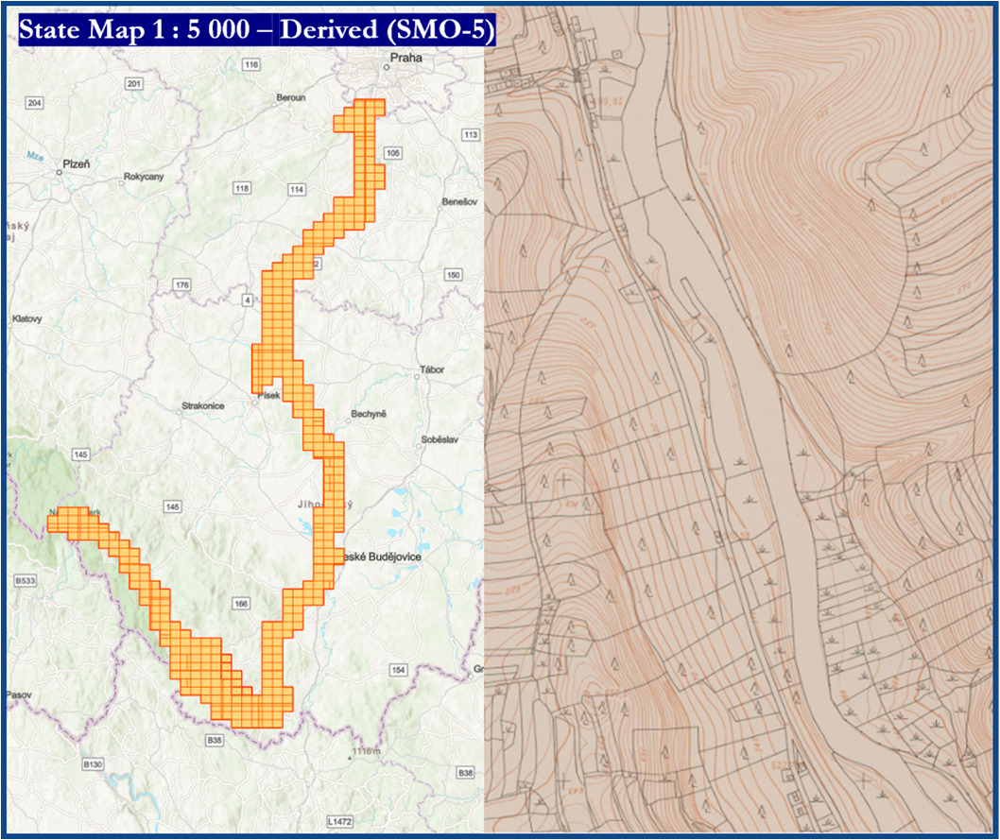

:::

::: {.notes}
- 1821-1840's
- 1950's

Ces sources: combines et enregistres sous un DTM Digital Terrain ModelGeoTIFF

Note: adaptation requise pour avoir informations qui matchent la taille de heightmap

(Si trop grand, erreur dans UE5)
:::

# Data preprocessing/importing

## Challenging of importing data inside UE5

- UE5 doesn't support GIS imports
- Use third-party plugins (paid)
  - Landscaping
  - TerraForm PRO

. . .

**BUT CityEngine can export to Datasmith which is supported by UE5 !**

::: {.notes}
Achetables sur marketplace de UE5

Landscaping

- import: quelques heures
- pas stable sur large datasets

TerraForm PRO

- import: 15 minutes
- pas limite sur systeme de coordonnees (Coordinate Reference System)
- MAIS coordonnees importees matchent systeme de coordonnee de UE5 (X = Y = Z = 0) => pas de possibilite d'import d'autres donnees... 

=> Option rejetee

CityEngine: 

- export bon format UE5
- Prend 2 minutes d'import
- Pas de transformation de coordonnees !!!
  - peut utiliser systeme utilise la-bas !!

Mais probleme resolution resolut avec irregular decimal pixel (0.987x1.123) au lieu de 1x1...
:::

## Preparation/Editing of GIS Data

::: {layout-ncol="2"}
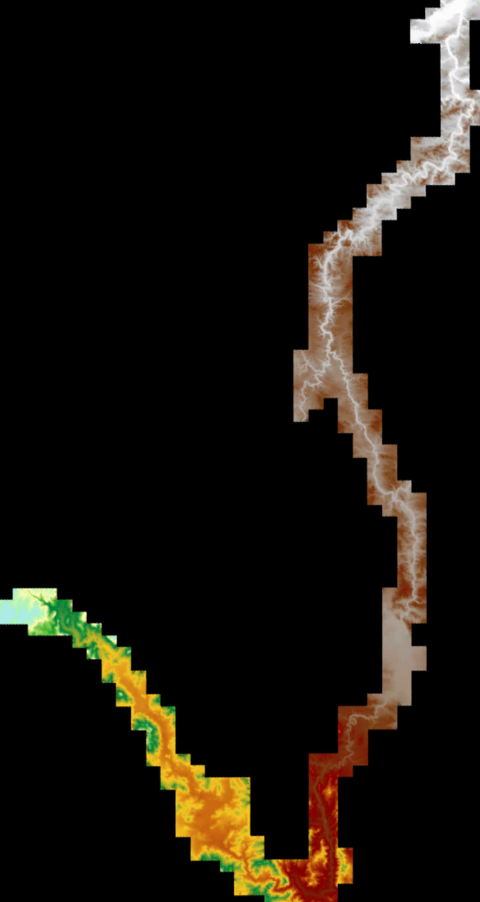

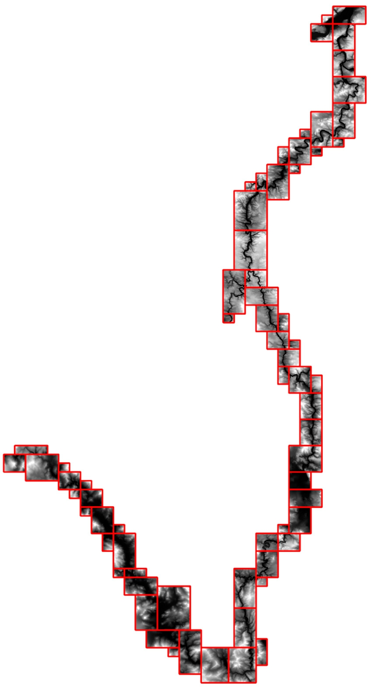
:::

::: {.notes}
- Trop de donnees inutiles (12700 $km^2$ au lieu de 1670)
- Separation en blocks (68)

Mais:

- Besoin de chevauchement entre blocks
- Mais faible sinon densite trop eleve d'objet genere proceduralement
- 32 floats sinon pas assez de bits pour coder l'information
  - landscape pas "smooth"

Avantages:

- Usage du World Partition
  - (rend seulement blocks / building / arbres/... proches de camera)

Pas importer chaque maison: trop grand nombre d'acteurs

=> utiliser texture qui indique l'emplacement de chaque maison
:::

## Note about Precision

::: {.shrink}

| Name                               | Area of DTM^[Digital Terrain Model] (km²)            | Pixel Size (m) | LZW Compression Size (GB) | Uncompressed Size (GB) |
|-----------------------------------|-------------------------------|----------------|----------------------------|--------------------------|
| Original DTM                       | 12,705                        | 5              | 0.263                      | 1.89                     |
| Upscaled DTM                       | 12,705                        | 1              | 5.76                       | 47.33                    |
| Upscaled 68 DTMs together + 5 m overlaps | 1,670                        | 1              | 2.32                       | 6.425                    |
| Upscaled 68 DTMs individually — Smallest | 5.07                         | 1              | 0.00711                    | 0.0193                   |
| Upscaled 68 DTMs individually — Largest  | 75.3                         | 1              | 0.103                      | 0.287                    |

:::

## Landscape Material

- Works with raster (images)
- Only support one material for landscape
- But multiple layers

. . .

**$\Longrightarrow$ Import textures as raster masks !**

::: {.notes}

Un raster = une image codant une information géographique sous forme de nombres.

- Blueprint utilisé pour découper matériel en couches

Note: masques de la dimension exacte du paysage !

Perte de données géographiques dans conversion vector data en raster masks !

Précision supérieur à 1m perdue car trop d'espace requis
:::

# Unreal Engine

::: {.notes}

Paramètres UE5 activés

- procedural foliage
- ...

:::

## Landscape Pro 3

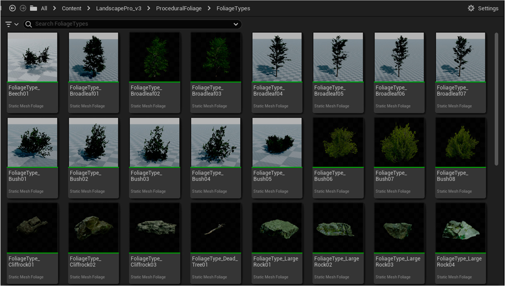

::: {.notes}

- Besoin d'assets
- Matériel de base qui contient tous les layers utiles

:::

## Base Landscape Material

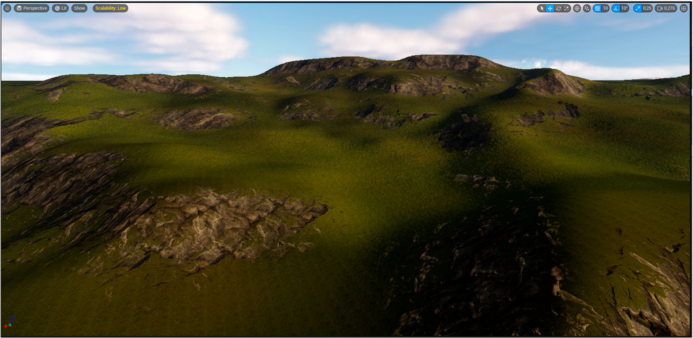

::: {.notes}

Chaque autre layer doit être créé séparément et importés (raster masks)

LIMITATIONS SUR L'IMPORT DES RASTERS

:::

## Procedural generation of Foliage

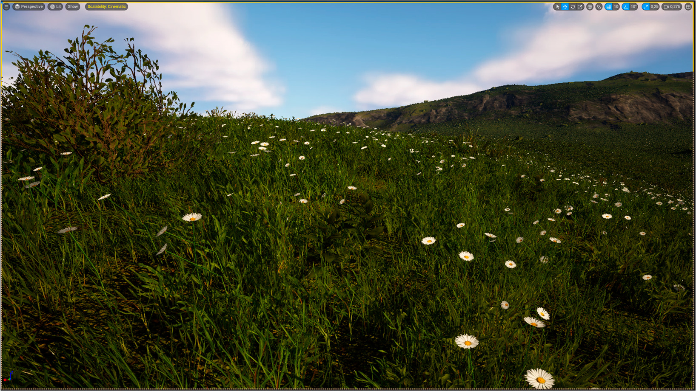

::: {.notes}

Dépend du layer

Base layer ne requiert pas de locations

Fully annimé

Prend en compte la pente pour ajuster la quantité et le type de végétation...

Procedural Foliage Spawner Actor pour générer arbres/rocks/...

(Pas oublier activer dans editor !!)

Temporal Anti-Aliasing pour éviter flickering et shimmering (lissage du mouvement en prenant en compte précédentes frames)

- (Flickering): feuilles très fines / textures alpha => peut disparaître et réapparaître...
- (Shimmering): détails fins trop petits pour tenir dans pixel => entre 2 pixels => impression que l'object vibre

:::

## Procedural generation of buildings

Vitruvio:

- Free for non-commercial use
- Based on CityEngine SDK API

. . .

- Cooking process

::: {.notes}

- Besoin de fichiers RPK créés dans CityEngine et requérant une license
- 21000 building générés
- stable process
- convertir vitruvio actors en mesh (éviter les réimportations après fermeture)
  - format propriétaire
  - Besoin de beaucoup de ressources
    - splitter en subset
    - attribuer plus de RAM ou SWAP (System virtual memory)
  - 170 GB utilisé
:::

## Water bodies

::: {layout-ncol="2"}

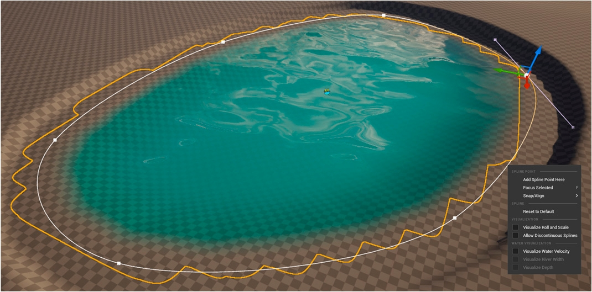

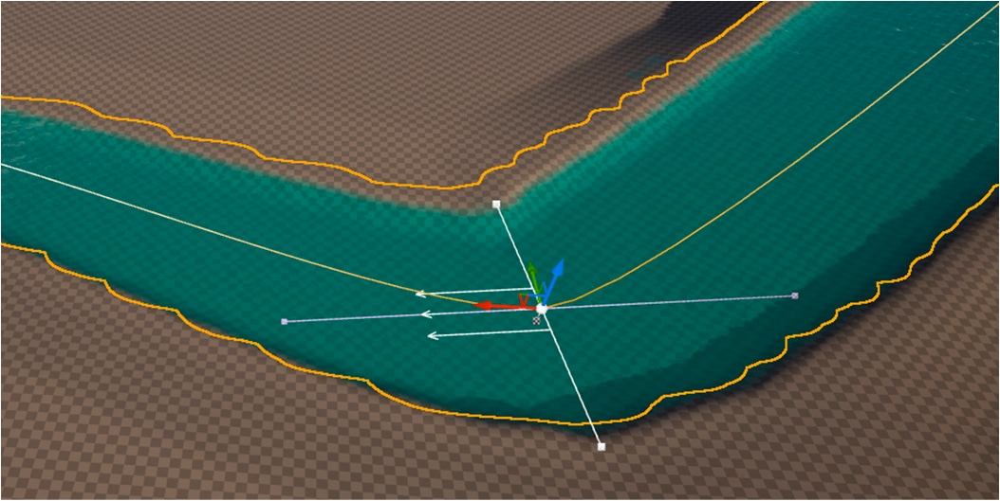

:::

::: {.notes}
- Expérimental
- Besoin d'être activé dans paramètres
- seulement 2 types utilisés (pas océan...)
  - pour rivières
  - pour lacs / gouilles (de ferme)
  - utilisation option déformer landscape
- Problème: fond de lacs / rivière pas donné par Digital Terrain Model...
- Shape 2D lac complexe
- Tout à recréer à la main...
- Rivière: spline avec hauteur... => plus complexe !
- Package project (supprime références invalides/cleanup)
:::

# Results

## Step followed

**Describe the entire approach !**

- data origin
- data preprocessing
- softwares / plugins
- configurations

## Evaluation

- compare to old Vltava project using GIS software
- performances / optimizations
- sharing / publishing
- 3D workflow

::: {.notes}

GIS (Geography Information System)

For this reason, the precision of these rasters had to be increased to
allow smaller areas and details in the vectorization not to be lost during the conversion
from vector polygons to raster pixels.

:::

## GIS vs Unreal Engine: distant view

::: {layout-ncol="2"}

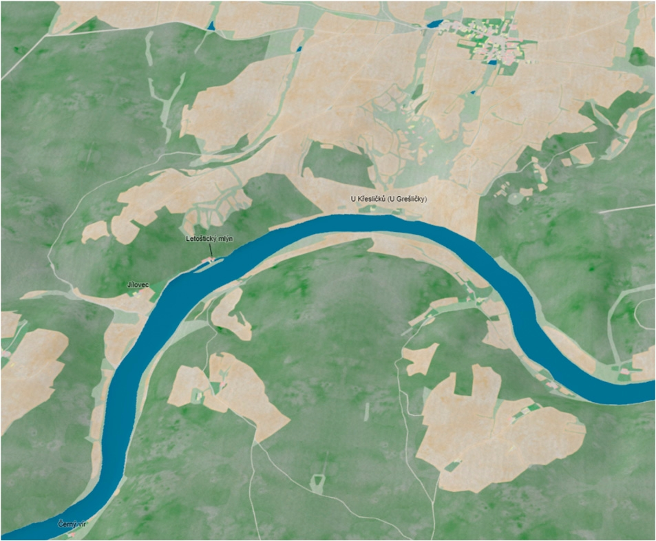

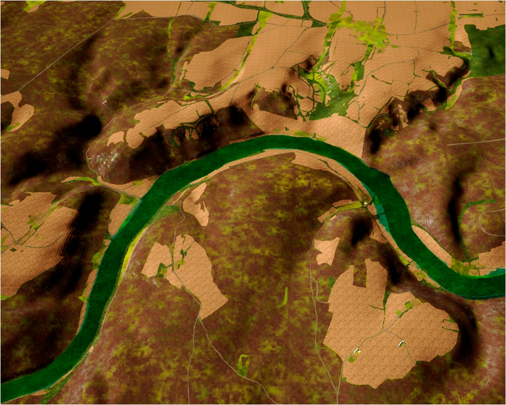

:::

::: {.notes}

- Textures plus realistes (plus sombres)
- Dynamic light
  - relief mieux défini

:::

## GIS vs Unreal Engine: Trees Level Of Details

::: {layout-ncol="2"}

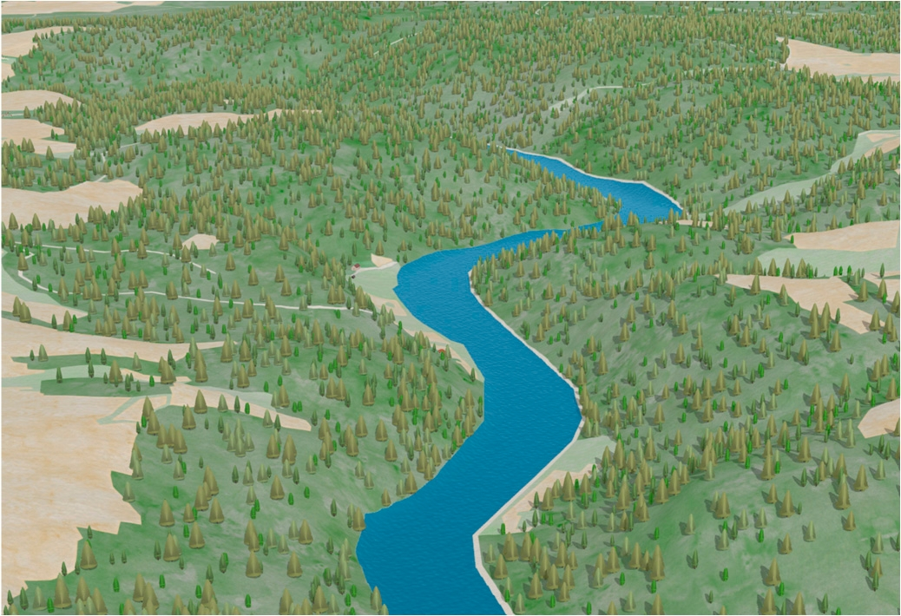

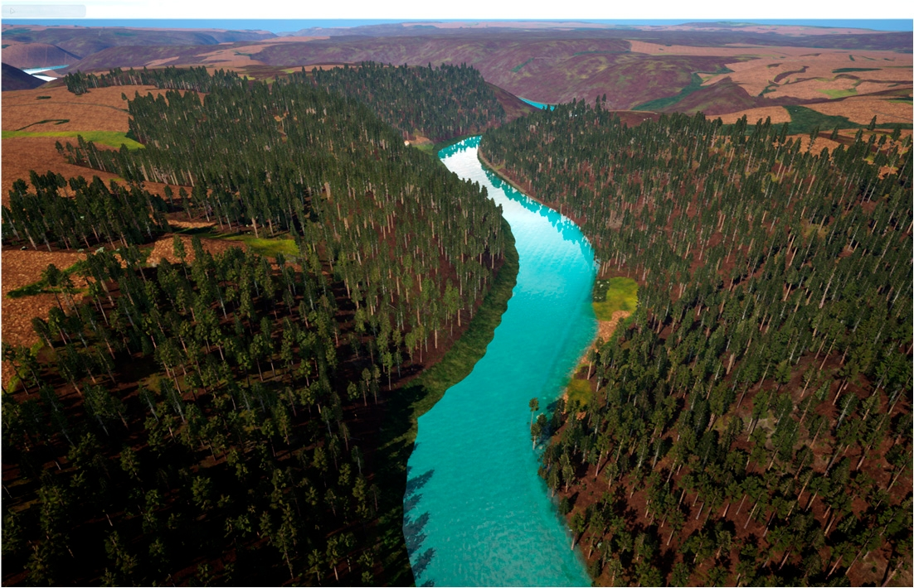

:::

::: {.notes}

- GIS: arbres très simples... Densité varie avec distance
- UE5: arbres complexes...
  - Densité constante
  - Modèle change avec distance

:::

## GIS vs Unreal Engine: vegetation

::: {layout-ncol="2"}

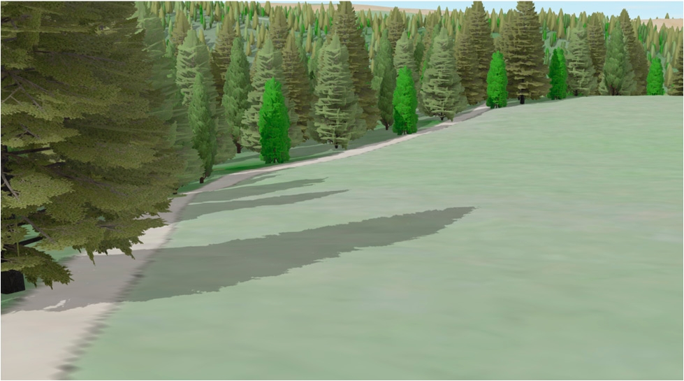

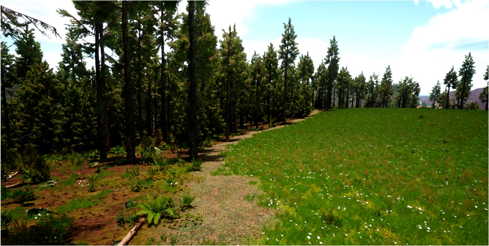

:::

::: {.notes}

- GIS: pas de végétation autres que arbres
- UE5: végétation et détails du sol

Problème sur les bords

- bords nettes
- bords pixelisés
- artifacts 
- pas transition progressive
- blending

:::

## GIS vs Unreal Engine: buildings

::: {layout-ncol="2"}

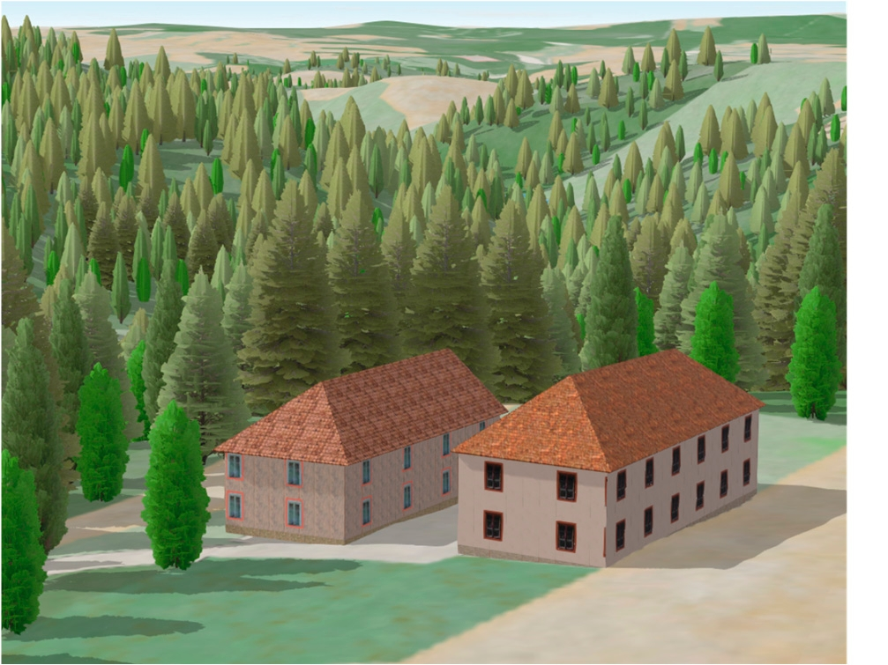

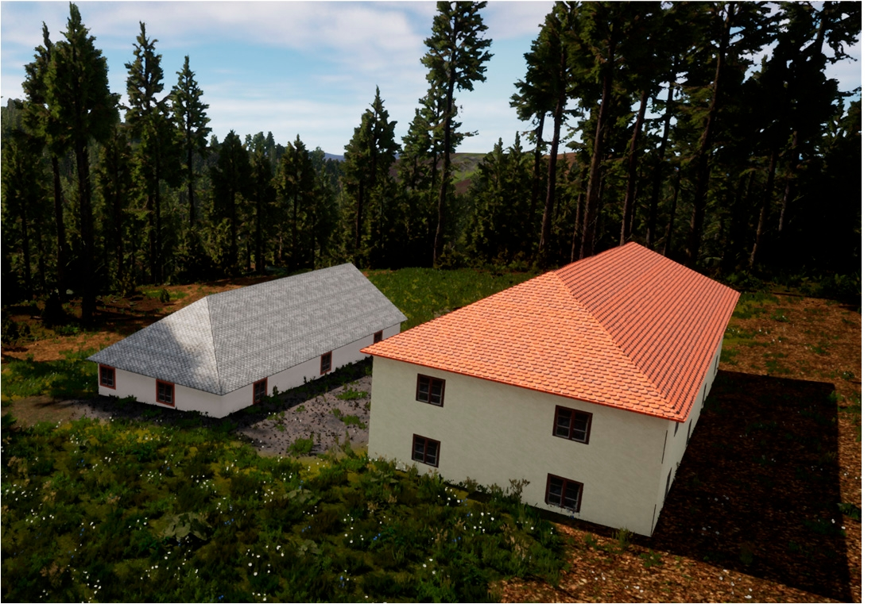

:::

::: {.notes}

Pas grande différence

Mais UE5 meilleur rendu

- ombres
- moteur de rendu

Mais moins bonnes couleurs

- light settings
- exposition
- attributs de textures

:::

# Discussion

## Vltava Project vs Rome Reborn {background-image="./img/rome.webp" .color-slide}

Rome Reborn

- **PAID** project since **2019** (no documentation anymore, ...)
- building visualization
- smaller area

::: {.notes}
Rome reborn

- depuis version 3.0 plus d'informations et switch sur Unity
- deviennent inutiles et uniquement pour VR tours...
- building créés en partie à la main (C4D, 3DSMax, time consumming...)
- 7000 buildings et 250 buildings créés à la main (autres générés avec CityEngine...)
- vs: 21000 buildings

:::

## Vltava Project vs Angkor {background-image="./img/angkor.webp" .color-slide}

Ancient city of Angkor in Cambodia

::: {.notes}
Angkor

- pas publique, mais plus d'informations
- 3500 km^2 GIS avec LiDAR data (drones scans)
- 2km^2 Unity
- VR exploration
- utilise game engine pour montrer routine des personnages d'époque
- mais pas beaucoup d'informations
- montre ce qui est possible, mais pas comment
- vs: but est montrer l'utilité et scalabilité d'UE5, pas d'exploiter le full potentiel du Game Engine...
:::

## Vltava Project vs Poyang Lake

- Vizualization of Poyang Lake accross seasons

::: {.notes}

Poyang Lake

- surtout végétations et différents types de plantes dépendant de saison
- informations sur les types de sols
- vs: informations sur les types de matériel (forêt / champs) et sur l'emplacement des maisons (procedural building)
- uses WebVR et html display (plus possible depuis 2019 dans UE5...) ou VR
- très similaire à Vltava (données réelles / textures et types de sol...)
- Mais Lake est essentiellement VR alors que Vltava est essentiellement PC application

:::

## Improvements

- Better visualization
- Problem in data coverage (terrain smaller than land use data)
- No way to get underwater parts caused by dams
- Simulation of broken dams in further works ?
- No road/alleys/barriers/... visualized
- Animals AI driven ?
- Real-time Ray Tracing

::: {.notes}

- Visualisation faite en même temps que l'écriture de l'article... Premier jet, mais peut passer plus de temps pour améliorer visualisation
- barrage: montrer quelles zones de la vallée de la Vltava sont sous l'eau en jouant avec niveau de l'eau (pas possible car eau à la main...)
- utiliser Landscapes Spline pour créer routes/barrières/...
- mais besoin définir taille de route... et extraction des datas dans GIS software...
- plus réaliste, mais plus de mémoire, besoin d'assets et tout à implémenter...
- raytracing: lumière/réflections/ombres améliorées mais coût en performances Mais rtx ont des cores dédiés pour ça...

:::

## Performance optimization

- Maximise FPS
  - RTX 4090: 80-120 FPS
  - RTX 4080: 60 FPS and more
  - RTX 4070: ~60 FPS

. . .

**Require good GPUs !**

*$\Longrightarrow$ Usage of Nanite to improve FPS performances !*

::: {.notes}

Nanite:

- très complexe
- s'occupe tout seul des niveaux de détails des objecs en fonction de leur distance
- travaille avec lumen
- mais problèmes avec foliage
  - utilisation de Shadow imposters (rendre les ombres des objets lointains sans forcément rendre les objects eux-mêmes) à la place, ce qui est en cours de test

:::

## Unreal Engine for Visualization ?

- Data not prepaired for Game Engines
- Need powerfull computer instead of online visualization on GIS
- Need to be downloaded

**$\Longrightarrow$ educational games !**

::: {.notes}

Approche plus active et moins réaliste est préférée pour les educational games...

- tourner sur mobile
- permet à plus d'users d'utiliser cela

:::

# Conclusion

## Conclusion

The use of a **game engine** for GIS visualization can have **many repercussions** in **different areas** of society.

. . .

For instance, it can enable the creation of more accurate **simulations** or the visualization of the **impact** of a **new** building.

. . .

One might wonder how the proposed workflow could be **improved** to achieve better results and how these results could be **evaluated** using created and fixed **metrics**.

# General analysis of paper

## About author and quality of journal/paper

- From student
- No h-index
- Paper only cited 5 times with only 4000 views
- But good journal: [International Journal of Geo-Information](https://www.mdpi.com/journal/ijgi)

::: {.notes}

- Peer review ont une réduction sur la publication -> incite à faire bon travail
- Légitime et reconnu (WoS, Scopus),
- Bonne visibilité internationale,
- Impact scientifique correct à bon,
- Sélectif, mais pas élitiste,
- Rapide, ce qui peut être stratégique.
- domaine géographie/planète

:::

## Abstract

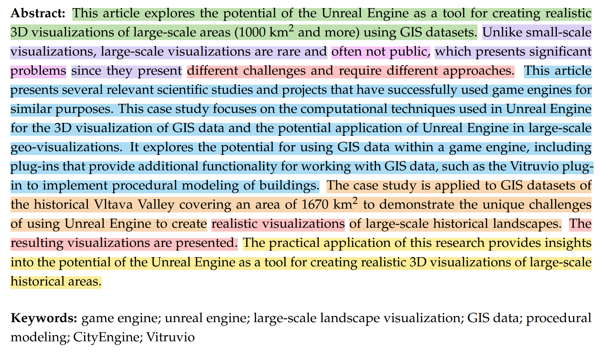

::: {.notes}

- Informative (200 words)
- Reason of writing clearly explained
- Problem to solve is not very clear (Why using game engines ? What are challenges ?)
- Methodology is right explained
- Results are only mentionned (But how to represent them ?)
- Implications not rightly created

:::

# Analysis of content

## Quality of content

- Good explanations
- But not enough technical
- Why analysis of other projects after the description of complete workflow ?

::: {.notes}

- Pas assez de détails techniques... J'ai appris des choses, mais pas tant que ça...
- Explications bonnes pour public moins techniques et n'ayant pas de connaissances au préalable dans le domaine
- Pourquoi pas expliquer avant les autres projets ???
  - Sinon, pas compréhension de pourquoi tout le workflow est autant détaillé
  - Workflow pas présenté dans autres projects (c'est une des motivations principales de cet article qui est mentionné que tardivement)
    - C'est le point qui fait la différence avec les autres projects !!

:::

## Remarks about paper

- Why using Game Engines ?
- Why not using advantages of Game Engines ? (Time reason)

::: {.notes}

- pas compris pourquoi pas utiliser Nanite (une des plus grandes forces de UE5) alors que c'était un peu l'objectif ??
- effectivement, mentionné est limite de temps ne permettant pas une exploration complète des possibilités... Seulement premier jet...

:::

## Remarks about results

- Looks not so realistic as expected (buildings, strange forest, hand-managed water...)
- But all workflow is here !

::: {layout-ncol="3"}

:::

::: {.notes}

- Material texture pas bien appliqué (quadrillage)
- Rugosité à mieux paramétrer (rochers avec plus de relief)
- Maisons pas réaliste
- Prochaine étape: ajout des routes !

:::

## What's about precision ?

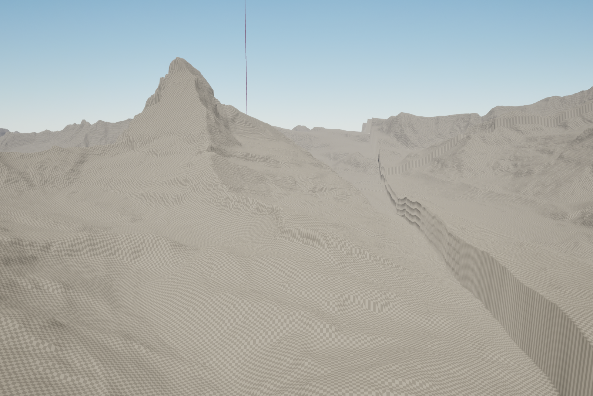

## What's about landscape realism ?

::: {layout-ncol="2"}

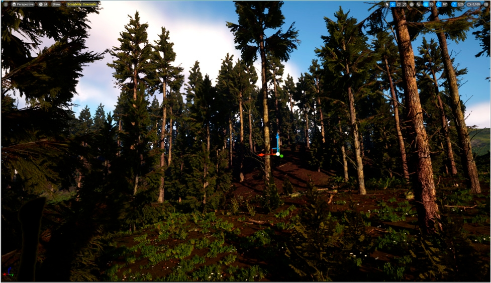

:::

# Thanks
